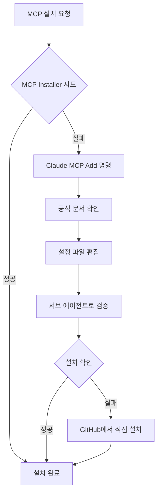

# MCP 자동 설치 가이드 - "설치해줘"라고만 하세요!

## 📌 개요

MCP(Model Context Protocol) 설치가 복잡하고 시간이 많이 걸린다고요? 이제 **MCP Installer**와 자동화 지침으로 대화하듯 쉽게 설치할 수 있습니다!

## 🚀 빠른 시작

### 1. MCP Installer 설치

WSL 환경에서 다음 명령어를 실행하세요:

```bash
# MCP Installer 설치 (전역 사용을 위해 --scope user 옵션 사용)
npm install -g @modelcontextprotocol/installer --scope user
```

### 2. 자동 설치 지침 설정

작업 폴더의 `CLAUDE.md` 파일에 다음 내용을 추가하세요:

```markdown
# MCP 자동 설치 지침

## MCP 설치 자동화 프로세스

1. **MCP Installer 우선 시도**
   - `mcp-installer` 명령어로 자동 설치 시도
   - 주소만으로 설치 가능한 MCP는 즉시 설치

2. **Claude MCP 명령어 사용**
   - MCP Installer 실패 시 `claude mcp add` 명령어로 전환
   - 공식 문서 참조하여 설정 파일 자동 편집

3. **서브 에이전트 활용**
   - 백그라운드에서 서브 에이전트 실행
   - 디버그 모드로 실시간 오류 확인
   - 재시작 없이 설치 상태 확인

4. **설치 확인**
   - `claude mcp list`로 설치된 MCP 목록 확인
   - 문제 발생 시 자동으로 재시도
```

### 3. 클로드 코드 실행

```bash
# 작업 폴더로 이동
cd /path/to/your/project

# 클로드 코드 실행
claude
```

### 4. MCP 설치 요청

이제 대화하듯 간단하게 요청하세요:

```
"Context7 MCP를 설치해주세요"
"Google Search MCP도 설치해주세요"
"MariaDB MCP 설치 부탁드립니다"
```

---

## 📋 설치 가능한 주요 MCP 목록

### 1. **Context7** - 라이브러리 문서 검색
- 설치 시간: 약 5-6분
- 공식 문서와 코드 예제 검색
- 다양한 프로그래밍 언어 지원

### 2. **Google Search** - 구글 검색 통합
- 설치 시간: 약 5분
- 클로드에서 직접 구글 검색
- API 키 필요

### 3. **MariaDB/MySQL** - 데이터베이스 연동
- 설치 시간: 약 5분
- 사전 요구사항: MySQL 서버 실행 중
- 데이터베이스 쿼리 실행

### 4. **Shrimp Task Manager** - 작업 관리
- 설치 시간: 약 20분 (복잡한 설치)
- Node.js 버전 업데이트 필요할 수 있음
- 관리자 권한 필요

### 5. **Playwright** - 브라우저 자동화
- 웹 스크래핑 및 테스팅
- 브라우저 자동화

### 6. **Magic** - UI 컴포넌트 생성
- API 키 필요 (visly.ai에서 발급)
- 무료 플랜은 사용량 제한 있음

---

## 🔧 설치 프로세스 상세

### 자동 설치 워크플로우



### 설치 시 자동 수행 작업

1. **환경 확인**
   - WSL 환경 체크
   - Node.js 버전 확인
   - 필요 권한 확인

2. **설치 시도**
   - MCP Installer 우선 사용
   - 실패 시 대체 방법 자동 전환

3. **설정 구성**
   - `mcp.json` 파일 자동 편집
   - 환경 변수 설정
   - 의존성 설치

4. **검증**
   - 백그라운드 서브 에이전트로 실시간 확인
   - 오류 메시지 캡처 및 대응
   - 설치 완료 확인

---

## ⚠️ 주의사항

### 1. 보안 설정

**중요**: 클로드 마크다운 파일에 API 키나 비밀번호가 포함된 경우:

```bash
# .gitignore에 추가 요청
"CLAUDE.md 파일을 .gitignore에 추가해주세요"
```

이렇게 하면 실수로 GitHub에 비밀 정보가 노출되는 것을 방지할 수 있습니다.

### 2. 사전 요구사항

- **Node.js**: 최신 버전 권장
- **WSL**: Windows 사용자의 경우 필수
- **관리자 권한**: 일부 MCP 설치 시 필요

### 3. 문제 해결

**설치 실패 시:**
1. Node.js 버전 업데이트
2. 관리자 권한으로 재시도
3. 수동으로 GitHub에서 클론 후 설치

**MCP가 인식되지 않을 때:**
1. 클로드 코드 재시작
2. `claude mcp list`로 설치 확인
3. `mcp.json` 파일 직접 확인

---

## 💡 고급 팁

### 1. 여러 MCP 동시 설치

```
"Context7, Google Search, Playwright MCP를 모두 설치해주세요"
```

### 2. 특정 버전 설치

```
"Context7 MCP의 최신 버전을 설치해주세요"
```

### 3. 설치 상태 확인

```
"현재 설치된 MCP 목록을 보여주세요"
"Context7 MCP가 제대로 작동하는지 테스트해주세요"
```

### 4. 업데이트

```
"모든 MCP를 최신 버전으로 업데이트해주세요"
```

---

## 📊 설치 시간 비교

| 방법 | 평균 소요 시간 | 난이도 |
|------|---------------|--------|
| 수동 설치 | 30분 ~ 수 시간 | 높음 |
| MCP Installer만 | 10-15분 | 중간 |
| **자동화 지침** | **5-6분** | **매우 낮음** |

---

## 🎯 결론

MCP 자동 설치 시스템을 사용하면:
- ✅ 복잡한 설치 과정을 5-6분으로 단축
- ✅ 대화하듯 쉽게 설치 요청
- ✅ 오류 발생 시 자동으로 대체 방법 시도
- ✅ 재시작 없이 실시간 설치 확인

이제 "설치해줘"라고만 하면 클로드가 알아서 다 해줍니다! 🚀

---

## 📚 추가 리소스

- [MCP 공식 문서](https://modelcontextprotocol.io)
- [MCP Installer GitHub](https://github.com/modelcontextprotocol/installer)
- [Claude MCP 명령어 가이드](https://docs.anthropic.com/claude/docs/mcp)

**문제가 있으신가요?** 클로드에게 직접 물어보세요: "MCP 설치 중 오류가 발생했어요. 어떻게 해결하나요?"